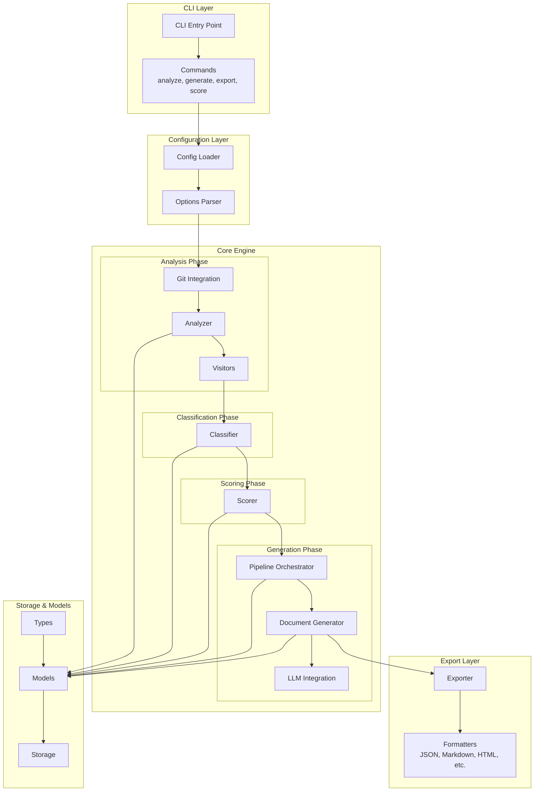
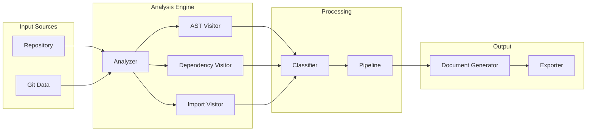
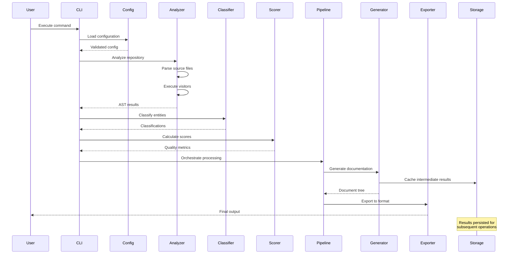
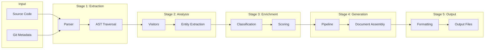
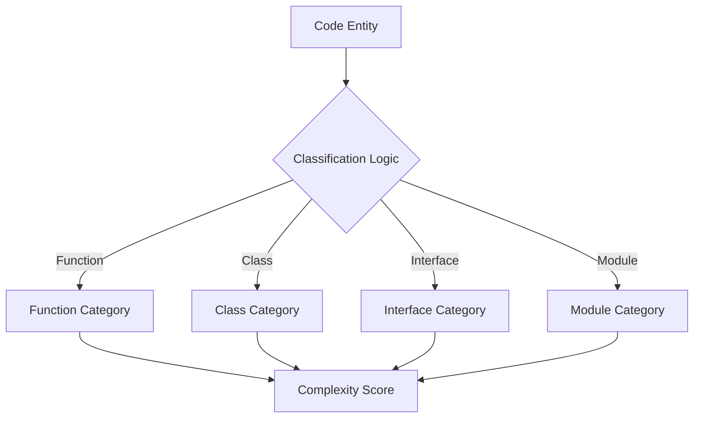
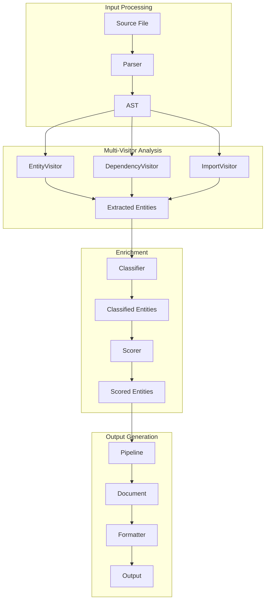
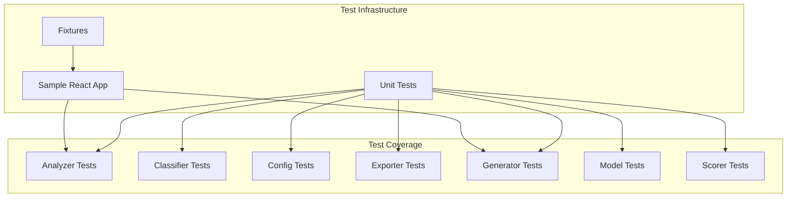

# codeplug — Architecture

## System Overview

codeplug is a sophisticated code analysis and documentation generation tool that processes source code repositories to extract, classify, analyze, and generate documentation through multiple export formats. The system employs a pipeline-based architecture that chains together analysis, classification, scoring, and generation phases.

The project comprises 79 source files distributed across 35 directories, with a clear separation between the core analysis engine, CLI interface, configuration management, and test infrastructure.

## High-Level Architecture



## Directory Structure

```
./ (79 files)
├── src/
│   ├── cli/                    # Command-line interface
│   │   └── commands/           # CLI command implementations
│   ├── config/                 # Configuration management
│   ├── models/                 # Domain models and entities
│   ├── storage/                # Persistence layer
│   ├── types/                  # TypeScript type definitions
│   └── core/                   # Core analysis engine
│       ├── analyzer/           # Static code analysis
│       │   └── visitors/       # AST visitor implementations
│       ├── classifier/         # Code classification logic
│       ├── exporter/           # Multi-format export
│       │   └── formatters/     # Output format implementations
│       ├── generator/          # Documentation generation
│       │   ├── documents/      # Document templates
│       │   ├── llm/            # LLM integration
│       │   └── pipelines/      # Processing pipelines
│       ├── git/                # Git repository integration
│       └── scorer/             # Quality scoring
├── tests/
│   ├── unit/                   # Unit test suite
│   └── fixtures/               # Test fixtures and samples
```

## Component Relationships



### Component Responsibilities

| Component | Responsibility | Public API |
|-----------|---------------|------------|
| `cli/commands` | Entry point for user commands | `execute(args): Promise<void>` |
| `config` | Load and validate configuration | `load(): Config`, `validate(cfg): boolean` |
| `analyzer` | Parse and traverse source code | `analyze(path): AST`, `visit(node): void` |
| `classifier` | Categorize code entities | `classify(entity): Classification` |
| `scorer` | Calculate quality metrics | `score(entities): Score[]` |
| `generator` | Create documentation from analysis | `generate(ctx): Document` |
| `exporter` | Format and write output | `export(doc, format): string` |
| `storage` | Persist analysis results | `save(data)`, `load(): Data` |
| `git` | Extract repository metadata | `getHistory()`, `getBlame()` |

## Data Flow



### Data Transformation Pipeline



## Key Abstractions

### Analysis Pipeline

The analyzer employs the Visitor pattern to traverse Abstract Syntax Trees (AST). Each visitor specializes in extracting specific entity types:

- **EntityVisitor**: Extracts functions, classes, interfaces
- **DependencyVisitor**: Maps import/export relationships
- **ImportVisitor**: Captures external dependencies

### Classification System

The classifier categorizes code entities based on structural analysis:



### Document Generation

The generator supports multiple document types through a pluggable architecture:

- **MarkdownGenerator**: Renders documentation in Markdown
- **HTMLGenerator**: Produces interactive HTML output
- **JSONGenerator**: Exports structured data for external tools

## Design Decisions

| Decision | Rationale |
|----------|-----------|
| **Pipeline-based processing** | Enables incremental processing and caching; allows parallel execution of independent stages |
| **Visitor pattern for analysis** | Decouples traversal logic from entity extraction; simplifies adding new analysis dimensions |
| **Separate storage layer** | Supports caching analysis results; enables incremental re-analysis |
| **Formatter abstraction** | Allows adding new export formats without modifying core logic |
| **LLM integration module** | Provides extensible interface for AI-assisted documentation generation |
| **camelCase for utilities** | Distinguishes pure functions from class-based services at naming level |
| **PascalCase for services** | Signals instantiable components with state and behavior |
| **Separate test directory** | Clear separation between production code and test infrastructure |
| **`.test.{ext}` naming** | Standard convention for test discovery by most test runners |
| **Co-located `__tests__/`** | Supports snapshot testing and keeps tests near implementation |

## Processing Flow Example



## Testing Strategy



The test suite maintains comprehensive coverage across all core components, with integration tests using the sample React application fixture to validate end-to-end behavior.

## Extension Points

The architecture supports extension through:

1. **Custom Visitors**: Add new analysis dimensions by implementing the Visitor interface
2. **Additional Formatters**: Implement the Formatter interface to support new output formats
3. **Pipeline Stages**: Extend the pipeline orchestrator to add custom processing stages
4. **LLM Providers**: Implement the LLM interface to integrate alternative AI services

## Configuration

Configuration is loaded hierarchically with the following precedence:
1. Command-line arguments (highest)
2. Project configuration file
3. Global defaults (lowest)