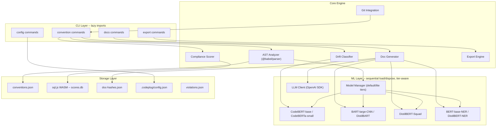

# CodePlug -- Executive Summary

CodePlug is a local-first TypeScript CLI tool that detects coding conventions from a codebase via AST analysis and on-device ML, enforces them through drift classification and compliance scoring, generates living documentation with LLM assistance, and exports convention context for AI coding agents (Claude, Cursor, Copilot). It targets engineering teams and solo developers who want a single source of truth for how their codebase works and how it should evolve.

---

## Architecture



---

## Design Decisions

| ID | Decision | Rationale |
|----|----------|-----------|
| DD-1 | Quality-first ML models with configurable tiers (default/lite) | Default to best models for accuracy; users on constrained machines swap to lite with a warning |
| DD-2 | Sequential model loading with explicit disposal | Never hold two models in memory simultaneously; prevents OOM on smaller machines |
| DD-3 | @babel/parser as primary AST engine (not ts-morph) | ~50x lighter memory, per-file parsing in 5-50ms vs multi-second project load |
| DD-4 | sql.js (WASM) instead of better-sqlite3 (native) | Zero native dependencies; no node-gyp, works everywhere Node.js runs |
| DD-5 | Lazy dynamic imports for CLI startup | Only Commander.js loaded at startup; heavy modules imported inside command handlers for <1s startup |
| DD-6 | globby for file system scanning | Built-in .gitignore support, parallel traversal via fast-glob |
| DD-7 | Ollama health check and cold-start handling | Detects unloaded models, shows spinner with ETA instead of appearing frozen |
| DD-8 | Unified LLM client via OpenAI SDK | One npm dependency for all providers (Ollama, OpenAI, Anthropic, Gemini, etc.) via `base_url` |
| DD-9 | File processing in batches with backpressure | 50-file batches keep peak memory bounded on large repos |

---

## Tech Stack

| Package | Version | Purpose |
|---------|---------|---------|
| `commander` | ^13.1.0 | CLI framework with nested subcommands |
| `@inquirer/prompts` | ^7.3.2 | Interactive terminal prompts |
| `@babel/parser` | ^7.26.9 | TypeScript/JSX/TSX AST parsing |
| `@babel/traverse` | ^7.26.9 | AST visitor pattern traversal |
| `@huggingface/transformers` | ^3.3.3 | On-device ML inference (ONNX) |
| `sql.js` | ^1.12.0 | WASM SQLite for score time-series |
| `simple-git` | ^3.27.0 | Git diff, commit history, hooks |
| `globby` | ^14.0.2 | File discovery with .gitignore support |
| `zod` | ^3.24.2 | Runtime schema validation |
| `chalk` | ^5.4.1 | Terminal styling |
| `ora` | ^8.2.0 | Progress spinners |
| `openai` | ^4.85.4 | Unified LLM client for all providers |
| `vitest` | ^3.0.5 | Test runner (dev) |
| `typescript` | ^5.7.3 | Strict mode, ES2022, NodeNext (dev) |

---

## ML Model Tiers

### Default Tier (8GB+ RAM recommended, ~1.1GB disk)

| Role | Model | Size |
|------|-------|------|
| Classification | `microsoft/codebert-base` | ~130MB (int8) |
| Summarization | `facebook/bart-large-cnn` | ~800MB (q4) |
| Q&A Extraction | `distilbert-base-cased-distilled-squad` | ~66MB (int8) |
| NER | `dslim/bert-base-NER` | ~110MB (int8) |

### Lite Tier (4GB RAM minimum, ~420MB disk)

| Role | Model | Size |
|------|-------|------|
| Classification | `huggingface/CodeBERTa-small-v1` | ~35MB (int8) |
| Summarization | `sshleifer/distilbart-cnn-6-6` | ~284MB (q4) |
| Q&A Extraction | `distilbert-base-cased-distilled-squad` | ~66MB (int8) |
| NER | `dslim/distilbert-NER` | ~35MB (int8) |

---

## LLM Provider Support

All providers use the OpenAI SDK via `base_url` configuration (DD-8).

| Provider | Base URL | Default Model |
|----------|----------|---------------|
| Ollama (default) | `http://localhost:11434/v1` | llama3 |
| OpenAI | `https://api.openai.com/v1` | gpt-4o |
| Anthropic | `https://api.anthropic.com/v1/` | claude-sonnet-4-20250514 |
| Gemini | `https://generativelanguage.googleapis.com/v1beta/openai/` | gemini-2.0-flash |
| OpenRouter | `https://openrouter.ai/api/v1` | anthropic/claude-sonnet-4-20250514 |
| Groq | `https://api.groq.com/openai/v1` | llama-3.3-70b-versatile |
| DeepSeek | `https://api.deepseek.com` | deepseek-chat |
| Grok | `https://api.x.ai/v1` | grok-2-latest |

---

## Project Structure

```
src/
  cli/
    commands/          -- convention, docs, export, config handlers
    index.ts           -- Commander.js entry with lazy imports
  config/
    ConfigManager.ts   -- .codeplug/config.json read/write
    ConventionSchema.ts -- Zod schemas for conventions
    defaults.ts        -- provider presets, file path constants
    types.ts           -- shared TypeScript interfaces
  core/
    analyzer/
      AstAnalyzer.ts       -- file discovery + batch AST parsing
      ConventionDetector.ts -- pattern-to-convention mapping
      PatternAggregator.ts -- frequency + confidence scoring
      visitors/            -- NamingVisitor, ComponentVisitor, TestVisitor,
                              ErrorHandlingVisitor, ImportVisitor, StructureVisitor
    classifier/
      DriftClassifier.ts   -- diff analysis against conventions
      ConfidenceGate.ts    -- threshold gating for ambiguous results
    scorer/
      ComplianceScorer.ts  -- severity-weighted scoring + persistence
      ViolationDetector.ts -- file-level violation detection
      AutoFixer.ts         -- rename + manual fix guidance
      TrendTracker.ts      -- linear regression + ASCII chart
    generator/
      DocGenerator.ts      -- orchestrator for all 5 doc types
      PipelineOrchestrator.ts -- sequential ML: summarize -> extract -> NER
      StalenessTracker.ts  -- SHA-256 hash-based doc freshness
      documents/           -- ReadmeGenerator, ArchitectureGenerator,
                              ConventionsGenerator, ContributingGenerator,
                              OnboardingGenerator
      llm/                 -- LlmClient, healthCheck, providerPresets
      pipelines/           -- SummarizationPipeline, ExtractionPipeline, NerPipeline
    exporter/
      ExportEngine.ts      -- orchestrator for all export targets
      FreshnessChecker.ts  -- export vs convention mtime comparison
      formatters/          -- ClaudeFormatter, CursorFormatter, CopilotFormatter,
                              JsonFormatter, CiFormatter
    git/
      GitIntegration.ts    -- simple-git wrapper
      PreCommitHook.ts     -- hook install/uninstall
  models/
    ModelManager.ts    -- download, cache, load/dispose lifecycle
    ModelRegistry.ts   -- tier-aware model ID + size mapping
  storage/
    ConventionStore.ts -- .codeplug/conventions.json
    ScoreStore.ts      -- sql.js WASM SQLite
    ViolationStore.ts  -- .codeplug/violations.json
```

---

## Performance Budget

| Operation | Target | Approach |
|-----------|--------|----------|
| CLI startup | < 1s | Lazy dynamic imports (DD-5) |
| Convention init (~500 files) | < 15s | @babel/parser per-file + batch processing (DD-3, DD-9) |
| Drift check on commit diff | < 3s | Single model load, quantized weights (DD-2) |
| Full audit (medium repo) | < 30s | AST re-analysis with cached patterns |
| Doc generation (all five) | < 2min | Sequential ML pipeline (DD-2), template fallback if no LLM |
| Export (all targets) | < 5s | Template rendering only, no ML |

---

## Data Files

All project-level data is stored in the `.codeplug/` directory at the project root.

| File | Format | Purpose |
|------|--------|---------|
| `config.json` | JSON | LLM provider settings, model tier selection |
| `conventions.json` | JSON (Zod-validated) | Confirmed coding conventions with confidence scores |
| `scores.db` | SQLite (WASM) | Time-series compliance scores and breakdowns |
| `doc-hashes.json` | JSON | SHA-256 hashes for staleness tracking per generated doc |
| `violations.json` | JSON | Most recent audit violations for auto-fix reference |
