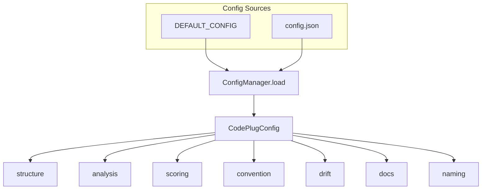
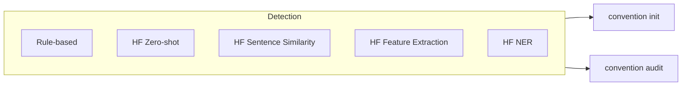

# CodePlug

## Executive Summary

This document provides comprehensive technical documentation for CodePlug, a local-first CLI tool designed to detect, enforce, and document coding conventions across TypeScript/JavaScript codebases. The guide covers installation, configuration, usage commands, project architecture, and development workflows for teams seeking automated codebase governance with AI agent integration capabilities.

---

## Overview

**The source of truth for codebase understanding and governance.**

CodePlug is a local-first CLI tool that detects your codebase's coding conventions, enforces them with drift detection and compliance scoring, generates living documentation, and exports convention context for AI coding agents.

The tool operates entirely on-device using ML models for pattern detection, ensuring your codebase data never leaves your machine unless you explicitly configure cloud LLM providers for enhanced documentation generation.

---

## Key Features

### Convention Detection

AST analysis with on-device ML identifies naming patterns, folder structure, component styles, test organization, error handling, and import conventions across your TypeScript/JavaScript codebase.

### Drift & Compliance

Classifies git diffs against stored conventions, scores compliance with severity-weighted metrics, tracks trends over time, and auto-fixes what it can.

### Living Documentation

Generates and maintains README, ARCHITECTURE, CONVENTIONS, CONTRIBUTING, and ONBOARDING docs using ML summarization and optional LLM enhancement.

### AI Agent Export

Exports your conventions as `CLAUDE.md`, `.cursor/rules`, `.github/copilot-instructions.md`, structured JSON, and SARIF-format CI reports.

---

## Prerequisites

- **Node.js 20+** (required) — CodePlug is built with TypeScript and requires Node.js 20 or higher for native fetch and modern ESM support.
- **Git** (required for drift detection and history analysis) — CodePlug integrates with Git for diff analysis, commit history inspection, and pre-commit hook management.
- **Ollama** (optional) — For LLM-enhanced documentation. Any OpenAI-compatible provider works as an alternative.

---

## Installation

### Global Install

```bash
npm install -g @dinyangetoh/codeplug-cli
```

### Local Development

```bash
git clone <repo-url>
cd codeplug
npm install
npm run build
node dist/cli/index.js --help
```

---

## Quick Start

```bash
# Install globally
npm install -g @dinyangetoh/codeplug-cli

# Navigate to your project
cd your-project

# Detect and confirm conventions
codeplug convention init

# Check compliance
codeplug convention audit
```

---

## Usage

### Convention Detection

```bash
# Detect and interactively confirm conventions
codeplug convention init

# Re-run detection, overwrite existing conventions
codeplug convention init --force
```

### Compliance Audit

```bash
# Full compliance report
codeplug convention audit

# Audit only changes from the last 7 days
codeplug convention audit --since 7d

# CI mode -- exits non-zero if score drops below threshold
codeplug convention audit --ci
```

### Drift Detection

```bash
# Check recent commits for convention drift
codeplug convention drift
```

### Compliance Score

```bash
# Show current score
codeplug convention score

# Show score history and trend chart
codeplug convention score --trend
```

### Auto-Fix

```bash
# Apply all safe auto-fixes
codeplug convention fix --auto

# Fix a specific finding by ID
codeplug convention fix --id naming-pascal-components
```

### Documentation Generation

```bash
# Generate all 5 documents
codeplug docs generate

# Generate a specific document
codeplug docs generate --doc ARCHITECTURE

# Tune for audience and style
codeplug docs generate --audience junior --style concise

# Check which docs are stale
codeplug docs status

# Regenerate only stale sections
codeplug docs update
```

### Export for AI Agents

```bash
# Export for a specific target
codeplug export --target claude
codeplug export --target cursor
codeplug export --target copilot

# Export all targets at once
codeplug export --all

# Check if exports are up to date
codeplug export --check
```

### Configuration

```bash
# View all settings
codeplug config list

# Get a specific value
codeplug config get llm.provider

# Set values
codeplug config set llm.provider openai
codeplug config set llm.model gpt-4o
codeplug config set llm.apiKey sk-...
```

---

## Configuration

CodePlug stores project-level configuration in `.codeplug/config.json`. The `config` command manages this file.

### LLM Provider

The default provider is Ollama (local). Setting a provider auto-fills its base URL and default model:

```bash
codeplug config set llm.provider ollama    # local, no API key needed
codeplug config set llm.provider openai    # sets baseUrl + model automatically
codeplug config set llm.provider anthropic
```

You can also set individual fields for custom endpoints:

```bash
codeplug config set llm.baseUrl https://my-proxy.example.com/v1
codeplug config set llm.model my-custom-model
codeplug config set llm.apiKey my-key
```

### Model Tier

```bash
# Full-size models (default) -- best quality, ~1.1GB disk, 8GB+ RAM recommended
codeplug config set models.tier default

# Lightweight models -- reduced quality, ~420MB disk, 4GB RAM minimum
codeplug config set models.tier lite
```

Switching to `lite` prints a warning about potential quality degradation.

### Configurable Sections

CodePlug supports optional sections in `.codeplug/config.json`. Each section merges with built-in defaults (shallow merge). Omit a section to keep defaults.



| Section | Purpose |
|---------|---------|
| `structure` | Architecture patterns (feature-based, MVC, layered) and directory placement rules (e.g. *Helper in helpers/) |
| `analysis` | Glob `include` and `ignore` for file discovery |
| `scoring` | Severity weights, compliance threshold, trend window |
| `convention` | Confidence threshold and dimension → severity map |
| `drift` | Confidence threshold and naming pattern regexes |
| `docs` | Tracked doc names, export targets, dev scripts |
| `naming` | Stem stopwords for file-responsibility extraction |

---

## Supported LLM Providers

All providers work through a single unified client via the OpenAI SDK.

| Provider | Setup |
|----------|-------|
| Ollama | `codeplug config set llm.provider ollama` (default, no API key) |
| OpenAI | `codeplug config set llm.provider openai` then set `llm.apiKey` |
| Anthropic | `codeplug config set llm.provider anthropic` then set `llm.apiKey` |
| Gemini | `codeplug config set llm.provider gemini` then set `llm.apiKey` |
| OpenRouter | `codeplug config set llm.provider openrouter` then set `llm.apiKey` |
| Groq | `codeplug config set llm.provider groq` then set `llm.apiKey` |
| DeepSeek | `codeplug config set llm.provider deepseek` then set `llm.apiKey` |
| Grok | `codeplug config set llm.provider grok` then set `llm.apiKey` |

---

## Model Tiers

| | Default | Lite |
|---|---------|------|
| Target machine | 8GB+ RAM | 4GB+ RAM |
| Disk usage | ~1.2GB | ~450MB |
| Classification | CodeBERT-base (125M params) | CodeBERTa-small (84M params) |
| Summarization | BART-large-CNN (406M params) | DistilBART (230M params) |
| NER | BERT-base-NER (110M params) | DistilBERT-NER (66M params) |
| Zero-shot | DistilBERT-MNLI (68MB) | DistilBERT-MNLI (68MB) |
| Sentence similarity | all-MiniLM-L6-v2 (23MB) | all-MiniLM-L6-v2 (23MB) |
| When to use | Production quality, CI pipelines | Local development on constrained hardware |

Models are downloaded on first use and cached in `~/.codeplug/models/`.

### Hugging Face Transformers

Convention detection, drift, and compliance use **on-device ML only** via `@huggingface/transformers`. No API keys or network calls for convention features.



**Pipelines by feature:**

| Feature | Pipeline | Use |
|---------|----------|-----|
| Convention discovery | Feature extraction (CodeBERT), token classification (NER) | Symbol semantics, entity extraction |
| Doc generation | Summarization (BART), question-answering (DistilBERT) | Living documentation |
| Semantic coherence | Zero-shot classification, sentence similarity (all-MiniLM) | "Does export X fit file context Y?" |

**LLM scope:** The LLM is **optional** and used only for prose generation in docs. Convention detection, drift, and compliance do not use an LLM.

**Cost:** Zero runtime cost for convention features; models are cached locally.

---

## Project Structure

```
src/
├── cli/
│   └── commands/           # Command handlers (convention, docs, export, config)
├── config/                 # ConfigManager, Zod schemas, types, provider presets
├── core/
│   ├── analyzer/           # AST analysis engine + 6 visitors + PatternAggregator
│   ├── classifier/         # Drift classification + confidence gating
│   ├── scorer/             # Compliance scoring, violation detection, auto-fix, trends
│   ├── generator/          # Doc generation, ML pipelines, LLM client, staleness tracking
│   ├── exporter/           # Export engine + 5 formatters (Claude, Cursor, Copilot, JSON, CI)
│   └── git/                # Git integration + pre-commit hook management
├── models/                 # ML model manager + tier-aware registry
├── storage/                # ConventionStore, ScoreStore (sql.js), ViolationStore
├── templates/              # Export templates (Claude, Cursor, Copilot)
└── tests/                  # Unit tests, integration tests, fixture repos
```

### Directory Details

| Directory | Purpose |
|-----------|---------|
| `cli/commands/` | Command handlers for the CLI interface |
| `config/` | Configuration management with Zod validation |
| `core/analyzer/` | AST-based code analysis with pattern aggregation |
| `core/classifier/` | Drift detection and severity classification |
| `core/scorer/` | Compliance scoring engine with trend analysis |
| `core/generator/` | Documentation generation with ML/LLM enhancement |
| `core/exporter/` | Multi-format export for AI coding agents |
| `core/git/` | Git integration for diff analysis and hooks |
| `models/` | ML model lifecycle management |
| `storage/` | File-based persistence (conventions.json, scores.json, violations.json) |

---

## Conventions

CodePlug follows these conventions throughout the codebase:

### Naming Conventions

- **Utility files** — Use camelCase (e.g., `formatDate.ts`, `parseConfig.ts`)
- **Class/service files** — Use PascalCase (e.g., `ConfigManager.ts`, `ConventionStore.ts`)
- **React components** — Use PascalCase file names (e.g., `Button.tsx`, `UserProfile.tsx`)
- **Hooks** — Use "use" prefix with camelCase (e.g., `useAuth.ts`, `useTheme.ts`)

### Testing Conventions

- **Separate tests/** directory — Integration and e2e tests live outside `src/`
- **Test file naming** — Use `.test.ts` or `.spec.ts` suffix
- **Co-located tests** — Use `__tests__/` directories for unit tests near source files

### Project Structure Conventions

- **Source root** — All source code resides in `src/`
- **Entry points** — CLI entry at `src/cli/index.ts`
- **Core modules** — Domain logic in `src/core/` subdirectories by responsibility

---

## Development

```bash
# Install dependencies
npm install

# Build
npm run build

# Type check without emitting
npm run typecheck

# Run tests
npm test

# Run tests in watch mode
npm run test:watch

# Run with coverage
npm run coverage

# Lint
npm run lint

# Lint with auto-fix
npm run lint:fix

# Watch build during development
npm run dev
```

---

## License

MIT